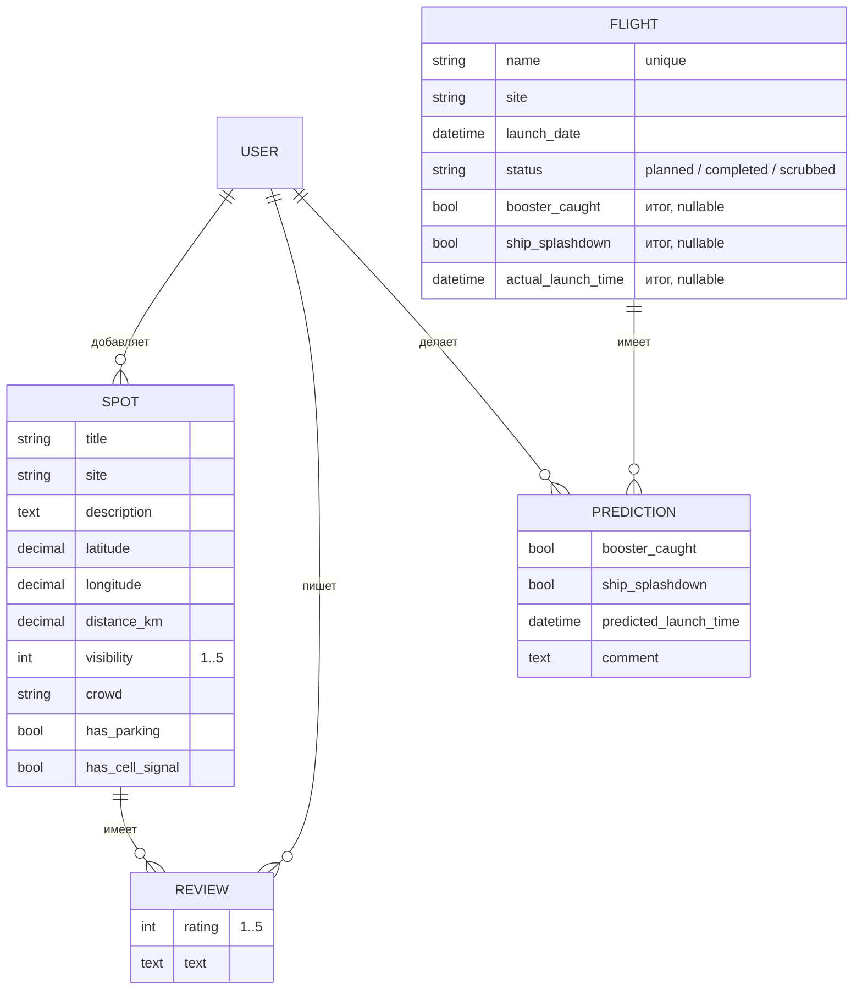

# Архитектура

Starbase Spotters - это монолитное Django-приложение с серверным рендерингом шаблонов.

## Приложения

| Приложение | Ответственность |
|---|---|
| `config` | настройки, корневой `urls.py`, номер версии (`__version__`) |
| `core` | главная страница, `LaunchSite`, `AuthorRequiredMixin`, `BootstrapFormMixin`, фильтр `stars`, команда `seed_demo` |
| `accounts` | регистрация (`SignUpView`), вход с формой Bootstrap, профиль (`ProfileView`) |
| `spots` | модели `Spot` и `Review`, CRUD, поиск, фильтры, карта |
| `flights` | модели `Flight` и `Prediction`, CRUD прогнозов, подсчёт очков (`scoring.py`), таблица лидеров |

Пользователи это стандартная модель `django.contrib.auth.models.User`.

## Модель данных

### Ограничения на уровне БД

- `Review`: уникальная пара `(spot, author)`, `rating` от 1 до 5.
- `Prediction`: уникальная пара `(flight, author)`.
- `Spot`: `visibility` от 1 до 5.

## Права доступа

| Действие | Гость | Пользователь | Автор записи | Администратор |
|---|---|---|---|---|
| Просмотр точек, отзывов, полётов, прогнозов, лидеров | ✅ | ✅ | ✅ | ✅ |
| Создание точки | → вход | ✅ | — | ✅ |
| Изменение и удаление точки или отзыва | → вход | 403 | ✅ | через админку |
| Отзыв на точку | → вход | ✅ (кроме своей) | — | — |
| Прогноз, его изменение и удаление | → вход | ✅ пока полёт открыт | ✅ пока полёт открыт | через админку |
| Создание полётов и внесение итогов | — | — | — | ✅ `/admin/` |

Проверку авторства делает `core.mixins.AuthorRequiredMixin`. Прогнозы после старта
блокирует `flights.views.PredictionsOpenMixin`.

## Подсчёт очков

`Prediction.score()` возвращает `None`, пока у полёта нет итогов (статус не
`completed` или не заполнены результаты). Иначе:

- +1, если угадано, поймана ли башня бустер;
- +1, если угадано, приводнился ли корабль;
- +1, если прогноз времени старта отличается от фактического не больше чем на
  `T0_TOLERANCE` (30 минут).

`flights.scoring.leaderboard()` суммирует очки по пользователям. Сортировка: по очкам,
затем по точности (очки / максимум), затем по имени.

## URL

| Путь | Назначение |
|---|---|
| `/` | главная |
| `/accounts/signup/`, `/accounts/login/`, `/accounts/logout/` | аккаунт |
| `/accounts/users/<username>/` | профиль |
| `/spots/`, `/spots/new/`, `/spots/<id>/`, `/spots/<id>/edit/`, `/spots/<id>/delete/` | точки |
| `/spots/<id>/reviews/new/`, `/spots/reviews/<id>/edit/`, `/spots/reviews/<id>/delete/` | отзывы |
| `/flights/`, `/flights/<id>/`, `/flights/leaderboard/` | полёты и лидеры |
| `/flights/<id>/predict/`, `/flights/predictions/<id>/edit/`, `/flights/predictions/<id>/delete/` | прогнозы |
| `/admin/` | админ-панель |
